# Hanoi Haven

## Project description
Welcome to Hanoi Haven - a responsive restaurant website, crafted using HTML, CSS, and JavaScript with a slider built using Swiper.js!

Check out my website here [Hanoi Haven](https://hanoihaven.netlify.app/)

## Screenshots

### Homepage
 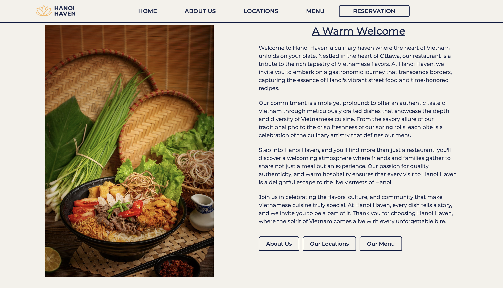 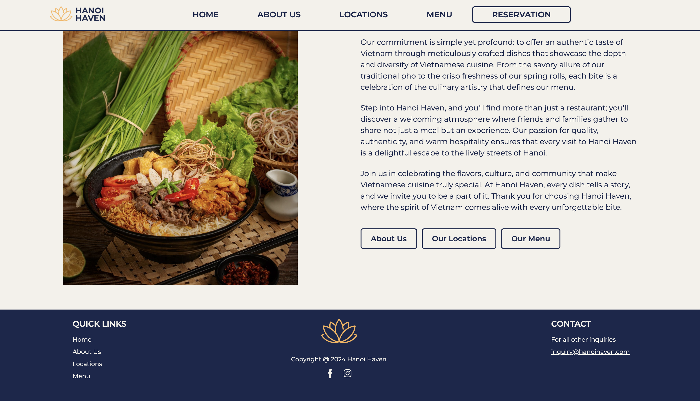

### About Us 
 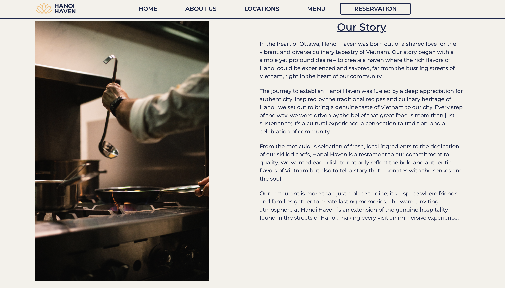  
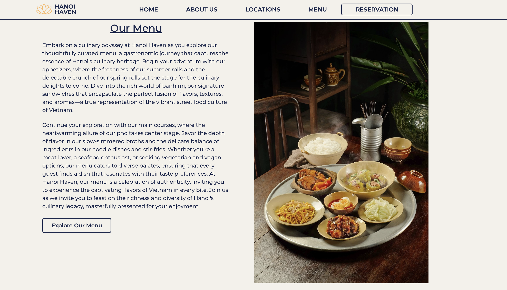 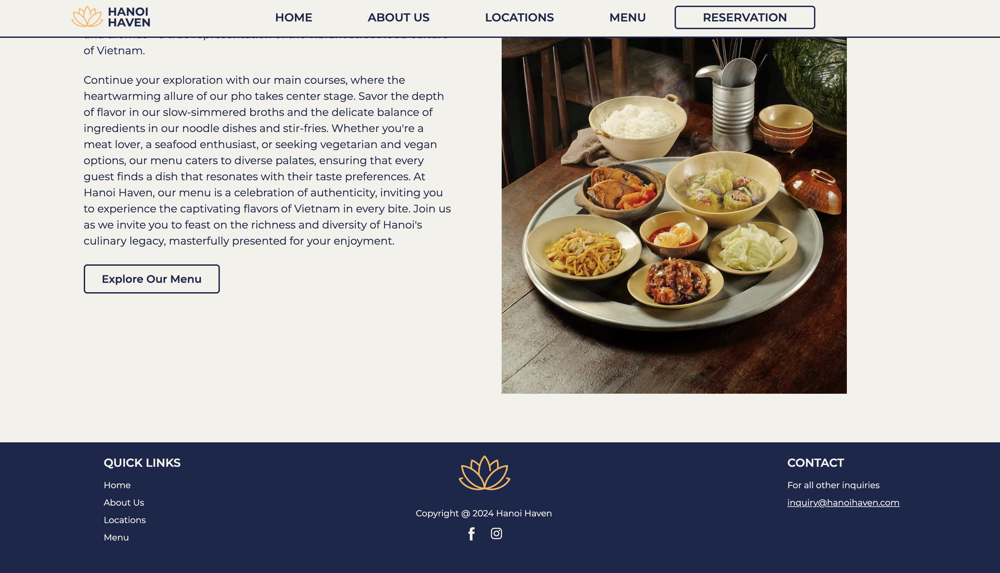 

### Locations
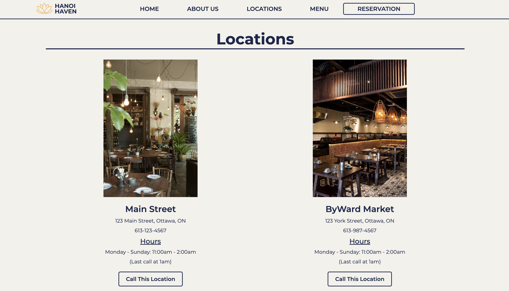 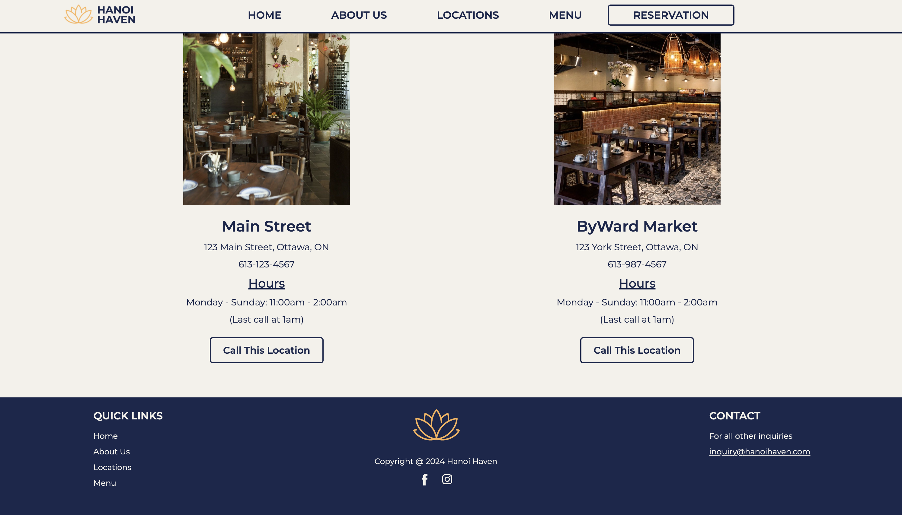 

### Menu
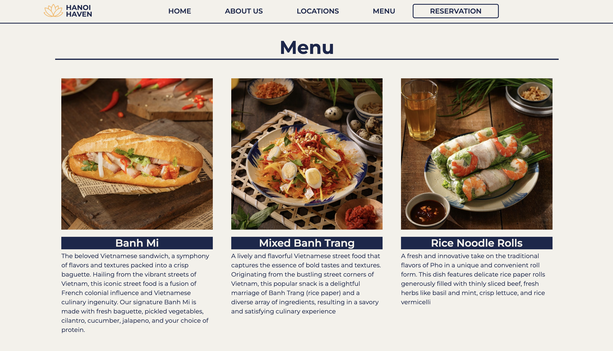   
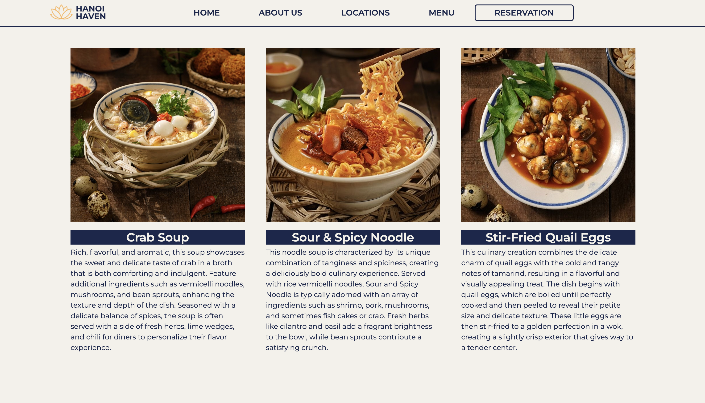 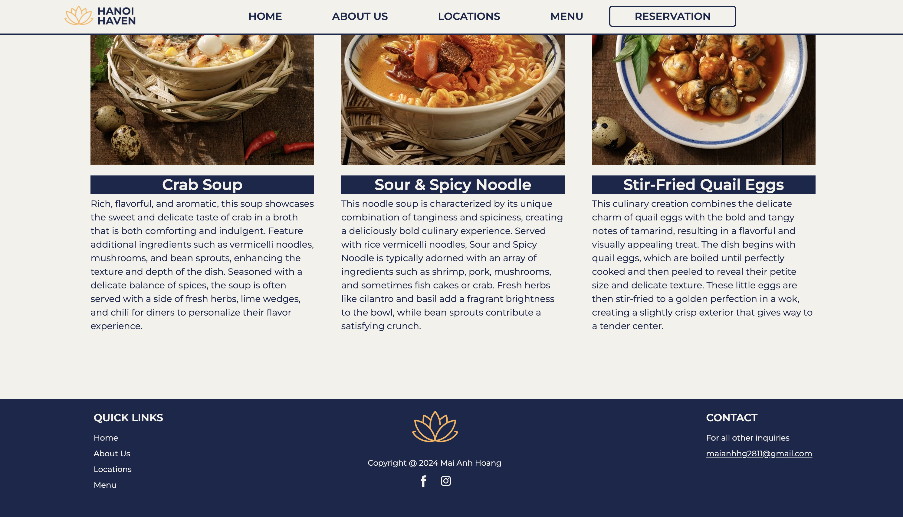

### Reservation
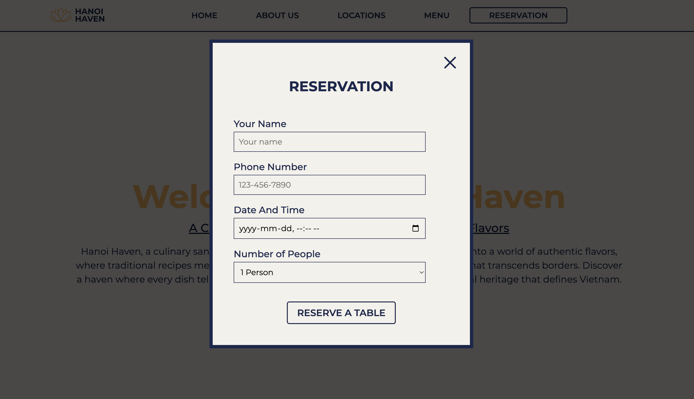
